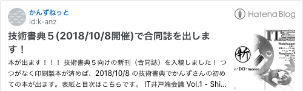

# この記事の内容

宣伝とかはバードくんやかんずさんが行っているので  

[ultrabirdtech.hatenablog.com](https://ultrabirdtech.hatenablog.com/entry/2018/09/22/081957)
  

[k-anz.hatenablog.com](https://k-anz.hatenablog.com/entry/2018/09/21/230839)
  
僕からは入稿までにどういったことを行ったのかという報告をしたいと思います。  
# 行ったこと

## サークル名の決定

サークル名の候補としてメンバーの共通点から決めようというのがありました。  

色々あったのですが身内ネタが濃すぎ・喧嘩を売り過ぎてるネーミングだったという自粛の点があり、生き残った候補の**shin・DO・meeee**にしたというのがあります。  
「*みんな なんらかの業（カルマ）とかしんどみあるでしょ？*」  
意味とかは宣伝のブログに記載しているので割愛します。  
気付かれている方々もいるかもしれませんが、  

技術書典5のサークルリスト上で**shin**じゃなくて**sin**になってるあれは  

スペルまで明確に決めていない時に先に登録してしまった名残で、  

間違えるのもsin（罪）だなというの感じて残したまましております。  
## サークルカットの作成

[techbookfest.org](https://techbookfest.org/event/tbf05/circle/49050001)
  
技術書典5の詳細にある画像は別のプロのもきちくんに作成していだたきました。  

なんでああなったのかの図にするとこれしかない案からデフォルメされた画像を作ってくれました。  
  

爆誕

  
PSDデータのレイヤー見ると細かい下書きの非表示レイヤーが残ってたり、  

画像作成してと依頼したのも直近なのにも関わらずに対応していただいて  

本当にありがとうございました。  
## 先駆者の意見を聞いてみること

初めて出展する人向けの勉強会があったので参加しました。  

[techbookfest.connpass.com](https://techbookfest.connpass.com/)
  
その中で知ったこととして  
- 確定申告方法
- 印刷所
- 作成方法
- ロイヤリティフリー素材の扱いについて
  （レビューの時にいらすとやの絵があるなぁと思ったけど規約内だったのでOKそうとか気付きがあった
- 過去の現場の声
など他のサークルの人から聞けたというのがあるので  

感謝だなぁと思っています。  
## 本の作成手順的なこと

### 本のタイトルの決定

みんな別々のテーマで書いていたので汎用性あるようなタイトルにならざるを得なかったです。  
### 執筆内容

モチベーション保って書けることを重視し各自自由にテーマを決めて書くようにしました。  

途中でテーマ変えたりとかもありました。  
### 執筆環境

これ完全に僕の圧でRe:VIEWで作成しましょうという風にしてしまったなぁと負い目を感じてますが、Re:VIEWで作成しました。  

ただRe:VIEWにしたことによるCIとの連携や、  

GitLab上でのMerge Requestのレビューが上手くいきましたので結果的によかったと思います。  
今回の環境のサンプルとしてこんなものを作成しました。  

[gitlab.com](https://gitlab.com/igara/review-template)
  
CI上で行わせたこととして  
- textlintによる簡単な文章構文の静的解析
- 電子書籍用のPDF作成
- 印刷用のPDF作成（本文のみのPDFにして隠し（通し）ノンブルを追加、ページ総数が奇数の時は空白ページをうめる
- ビルド結果をDiscordに通知
Merge Requestのレビューついては  

今までこのメンバーで議論をするということがあまりなかったので楽しかったです。  

（途中、議論したがり欲でようわからん難癖議論をしてすみませんでした。  
勉強会でも議論になっていたことですが、  

レビューしてくれる人がいなくてどうしようというのがある中で  

僕達のサークルでは相互にレビューしてくれる人がいるというのはありがたいことだと思いました。  
### しんどみあったとこ

- マージン調整とかでLaTexの知見が必要になったところ
  （CSSやっていき組だったらまた別の世界があったのかもしれない
- textlintででたerrorをignoreするか議論
  （固有名詞として存在するけど長い漢字の単語なのでerrorが出るとか
- PDF出力すると半角の_（アンダースコア）がなんかでかくみえる
  （未解決
## 入稿手順的なこと

### 印刷所の決定

日光企画さんにしました。  

理由としては[http://www.nikko-pc.com/only-event/backup.html](http://www.nikko-pc.com/only-event/backup.html)とかのページを見ると入稿から本が納品される日の目安が見れて良いというのと  

技術書典のバックアップ印刷所でもあるので本の受け取りが会場でできて楽そうだったからです。  
### 入稿日の決定

早めに印刷所に入稿すると割引が適応されるので当初は50%引きの日に入稿しようとしていました。  
### 入稿の仕方・添削をしてもらう

日光企画さんにお伺いし、いただいた指摘として  
- 出力された本文がB5サイズのものではない
  （今回はB5想定ではない本文の中心から無理やりB5サイズに適応した
     Re:VIEWの設定でtexdocumentclass: ["jsbook", "uplatex,oneside,b5j"] を忘れていた
- 本文全体に通しノンブルがない
- 本の厚さに適応した表紙の設置がされていない
  （もきちくんに依頼してたけど細かい指示内容なしで
  日光企画さんのテンプレートに表紙載っけてとしか言わなかったので反省してます。
  あとB5で入稿できそうな雰囲気がなかったので別のフォーマットの提示とか
  かわいそうな事させたなぁと思っています。
### 入稿申し込み・入金

申し込みした結果  
- B5
- 34ページ（表紙4ページ + 本文30ページ
- 50冊
- 左綴じ
- 平綴じ
- クリアPP（表紙の加工
- 本文用紙 上質90
- オンデマンド スミ
- 割引適応40%
計15,180円 になりました。  
# さいごに

様々な方の知見を借りる事で進める事ができたなぁと思います。  
当日寝坊しないようにがんばろう  
