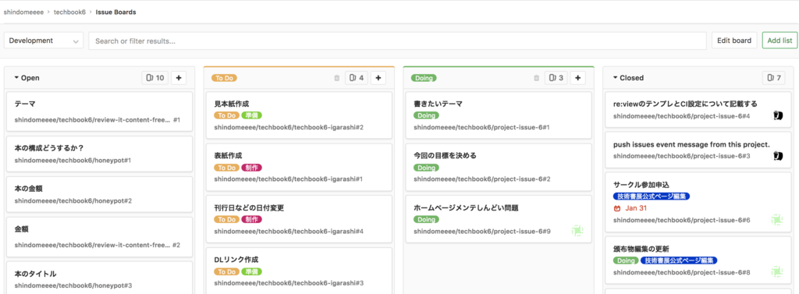
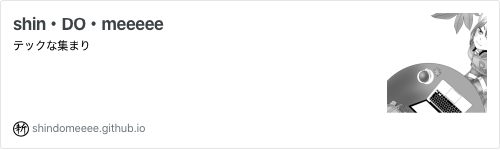
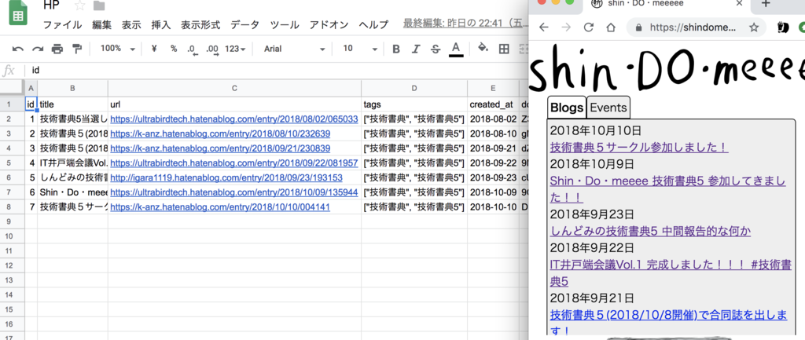
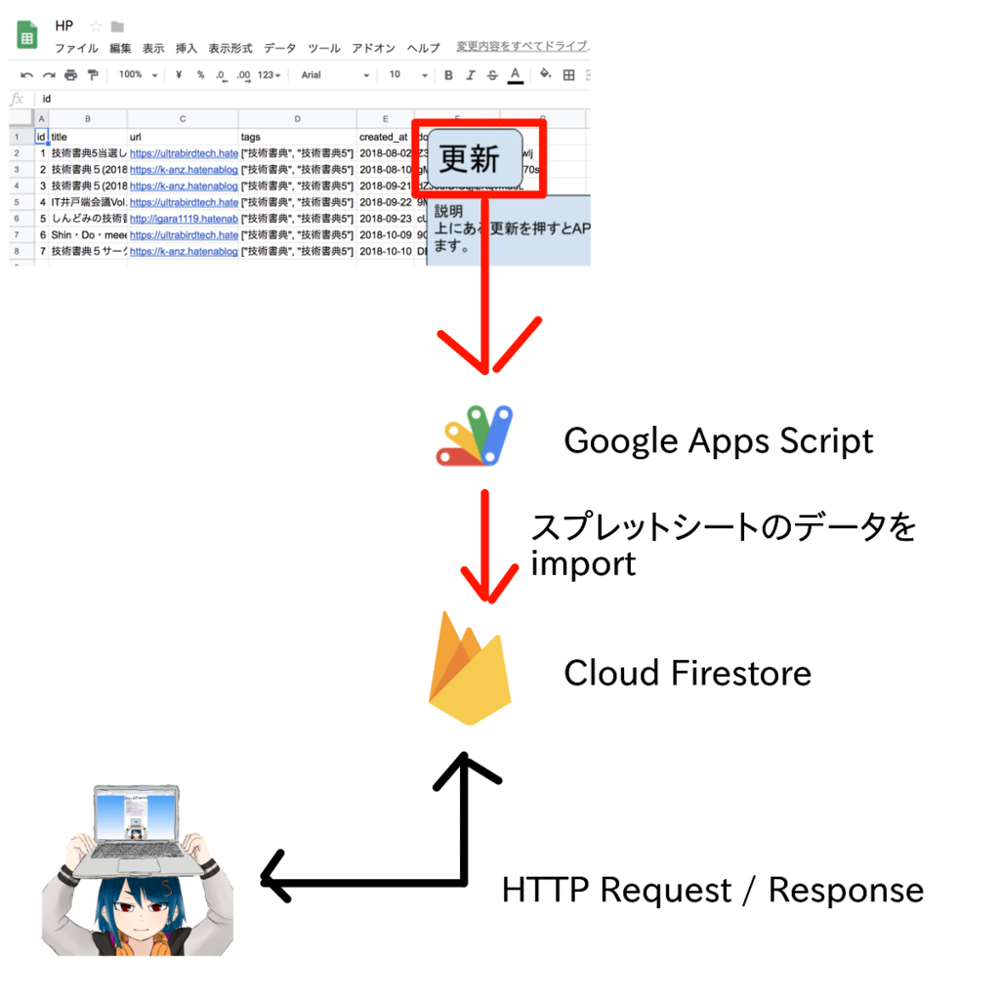
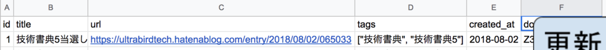
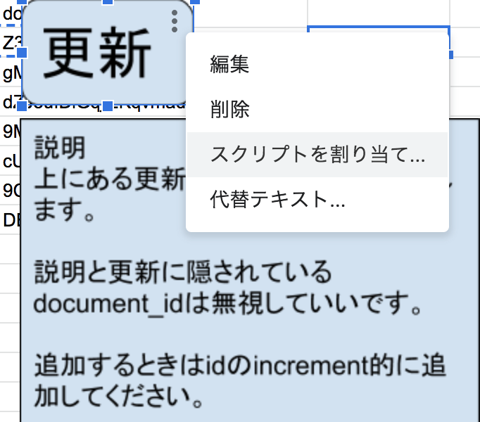
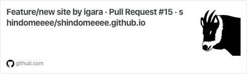
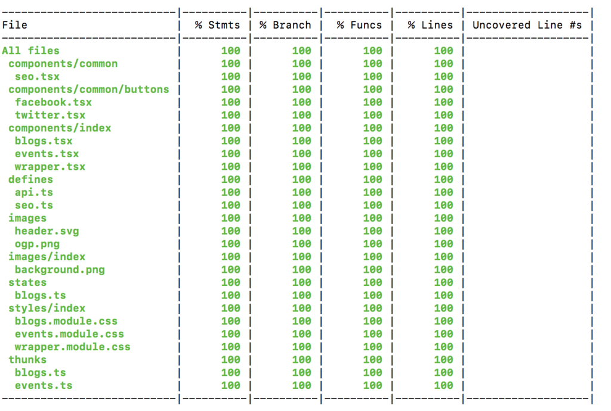

  

平成の終わりが近いですね

  
## 先にサークル現状の報告

この場を借りて先に今のサークル（shin・DO・meeeee）がどうしているのかという報告をさせていただきます。  
結論言ってしまうと
先月の2月5日に 技術書典6 のサークル当落通知というのがあって落選してしまったので技術書典6には参加しません。  
技術書典5以降の技術書典6に向けたサークル内部の動きとして  
- GitLabのサブプロジェクト機能・issues board機能使っていい感じに細かいタスクの可視化
  
- Hangoutで打ち合わせするようになった
とかあって前回とは違った問題解決できてきたなぁと思ったんですけどね。  
## HPリニューアルしました

こちらになります。  
[](https://shindomeeee.github.io/)
[shindomeeee.github.io](https://shindomeeee.github.io/)
  
リニューアルをおこなった理由としては先ほどのissues boardの画像で目移りしたかもしれませんが  
ホームページメンテしんどい問題  
があって告知用とかマルチに使おうとして結果的に放置されてしまったというのがありました。
HPの作成段階では実績もなく [なんとなくなデザイン作成](https://github.com/shindomeeee/shindomeeee.github.io/pull/3) とかの負債があったなぁと感じてあのHPの立ち位置を考え直し、  
- みんなブログなら記載する
- 実績のみ載せるLP的なページの認識であった方がライトで良さそう
というのに気づいて思い切って今までのホームページを捨てることにしました。  
HPにあるリンクとかもGoogleのスプレットシートで管理するようにしたのでよりサークル内部の情報をまとめやすくなったんじゃないかなと思っています。


  
あとはイラストなど素材も充実してきたのでHPにも導入するようになったのも大きな変更です。
（あのイラストは汎用性高いので気に入ってます。  
## ここから玄人（バイニン）向け

あのHPを僕1人でメンテするのもあれで、やったこと結構エグいのが多かったのでナレッジ残す意味あいで色々記載します。
※記載している内容はほとんど僕の趣味によるものが強いです。  
### Blogs一覧取得API作成

- API・DBはFirebaseのCloud Firestore(最近GAになったらしいですね
- マスタ管理としてSpreadSheet
- SpreadSheet -> Cloud Firestoreにデータ反映する仕組みとしてGoogle Apps Scriptを使用しています。
図にするとこんな感じです  


  
なぜの構成にしたかというとサークルメンバーのGoogleアカウントわかっていたのでIAM管理もGoogleにさせてしまった方が楽だったからです。  
#### Cloud Firestoreの設定

##### ルール

SpreadSheetに入力できてFirebaseのロールを持っている人への書込み権限
一覧のデータを取得するための読み込み権限
を下記のようなので設定  

```
service cloud.firestore {
  match /databases/{database}/documents {
    match /blogs/{document=**} {
      allow read;
      allow write: if request.auth;
      allow delete: if request.auth;
    }
    match /events/{document=**} {
      allow read;
      allow write: if request.auth;
      allow delete: if request.auth;
    }
  }
}

```

#### SpreadSheetの設定



  
CSVにすると  

```
id,title,url,tags,created_at,document_id
1,技術書典5当選しました！！！,https://ultrabirdtech.hatenablog.com/entry/2018/08/02/065033,["技術書典", "技術書典5"],2018-08-02,hogehoge
```

な構成にし、列の説明として  
- id -> 順番
- title -> ブログタイトル
- tags -> 現在使用してないけど絞り込み検索とかで使用する想定
- created_at -> ブログの公開日
- document_id -> Firestoreのdocument_id
な感じで  


  
SpreadSheet上に描画ツールで作成した更新ボタンにGoogle Apps Scriptのスクリプトを割り当てできるようにします。  
#### Google Apps Script

Google Apps Script経由でSpreadSheetの内容取得、Firestoreに書込みができるように
マニフェストファイルを編集します  
appsscript.json  

```
{
  "timeZone": "Asia/Tokyo",
  "dependencies": {
    "libraries": []
  },
  "exceptionLogging": "STACKDRIVER",
  "oauthScopes": [
    "https://www.googleapis.com/auth/firebase.database",
    "https://www.googleapis.com/auth/script.external_request",
    "https://www.googleapis.com/auth/spreadsheets.currentonly",
    "https://www.googleapis.com/auth/spreadsheets",
    "https://www.googleapis.com/auth/datastore"
  ]
}

```

肝心なのがoauthScopesで  
- [https://www.googleapis.com/auth/script.external_request](https://www.googleapis.com/auth/script.external_request)
外部にリクエストするUrlFetchApp.fetchの使用を許可
- [https://www.googleapis.com/auth/spreadsheets.currentonly](https://www.googleapis.com/auth/spreadsheets.currentonly)
- [https://www.googleapis.com/auth/spreadsheets](https://www.googleapis.com/auth/spreadsheets)
SpreadSheetの内容を取得するために必要
- [https://www.googleapis.com/auth/firebase.database](https://www.googleapis.com/auth/firebase.database)
- [https://www.googleapis.com/auth/datastore](https://www.googleapis.com/auth/datastore)
Firestoreに書込むために必要
で追加してます。  
あとはスクリプトの追加で  
blogs.gs  

```
function setBlogs() {
  // 列の扱うデータの配置
  const columnNumbers = {
    id: 0,
    title: 1,
    url: 2,
    tags: 3,
    created_at: 4,
    document_id: 5
  }

  const rowNumbers = {
    // 列名がある箇所の配置
    scheme: 0
  }
  const apiUrl = "https://firestore.googleapis.com/v1/projects/(project id)/databases/(default)/documents/blogs"
  // 後にdocument_idを取得するために使用
  const removeString = "projects/(project id)/databases/(default)/documents/blogs/"

  // マニフェストファイル(appsscript.json)にあるoauthScopesで許可されたoauth tokenを取得
  const token = ScriptApp.getOAuthToken()
  const headers = {
    authorization: "Bearer " + token
  }

  // 対象のSpreadSheetのURL
  const url = "https://docs.google.com/spreadsheets/d/(SpreadSheet ID)"
  const spreadsheet = SpreadsheetApp.openByUrl(url)
  // SpreadSheetの読み込みたいシート
  const blogsSheet = spreadsheet.getSheetByName('blogs')
  const blogsData = blogsSheet.getDataRange().getValues()
  // IDの逆の順番にする(最新のものを先に登録させるため Firestore REST APIのorderBy asc があれば...)
  blogsData.reverse().pop()

  blogsData.forEach(function(blog, rowIndex) {
    const id = blog[columnNumbers.id]
    const title = blog[columnNumbers.title]
    const url = blog[columnNumbers.url]
    const tags = JSON.parse(blog[columnNumbers.tags])
    const created_at = new Date(blog[columnNumbers.created_at]).toISOString()

    if (blog[columnNumbers.document_id]) {
      const targetDocumentId = blog[columnNumbers.document_id]
      const deleteOptions = {
        method: "delete",
        contentType: "application/json",
        headers: headers,
        muteHttpExceptions: true
      }
      const deleteResponse = UrlFetchApp.fetch(apiUrl + "/" + targetDocumentId , deleteOptions)
      const deleteResponseCode = deleteResponse.getResponseCode()
      const deleteResponseBody = deleteResponse.getContentText()

      if (deleteResponseCode === 200) {
        const deleteResponseJson = JSON.parse(deleteResponseBody)
      } else {
        Logger.log(Utilities.formatString("Request failed. Expected 200, got %d: %s", deleteResponseCode, deleteResponseBody))
      }
    }

    if (id && title && url && tags && created_at) {
      const createPayload = {
        fields: {
          id: {
            integerValue: rowIndex + 1
          },
          title: {
            stringValue: title
          },
          url: {
            stringValue: url
          },
          tags: {
            arrayValue: {
              values: tags.map(function(tag) {
                return {stringValue: tag}
              })
            }
          },
          created_at: {
            timestampValue: created_at
          }
        }
      }

      const createOptions = {
        method: "post",
        contentType: "application/json",
        payload: JSON.stringify(createPayload),
        headers: headers,
        muteHttpExceptions: true
      }
      const createResponse = UrlFetchApp.fetch(apiUrl, createOptions)
      const createResponseCode = createResponse.getResponseCode()
      const createResponseBody = createResponse.getContentText()

      if (createResponseCode === 200) {
        const createResponseJson = JSON.parse(createResponseBody)
        const documentId = createResponseJson.name.replace(removeString, "")
        blogsSheet.getRange(id + 1, columnNumbers.document_id + 1).setValue(documentId)
      } else {
        Logger.log(Utilities.formatString("Request failed. Expected 200, got %d: %s", createResponseCode, createResponseBody))
      }
    }
  })
}

```

な感じで雑にSpreadSheetにあるデータを正とするためにFirestore上のデータ全消しした後で再度追加するようにしてます。  
このスクリプトに先ほどSpreadSheetのボタンにスクリプトの割り当てをすることでボタンから更新することが可能になります。  
### フロント実装

[](https://github.com/shindomeeee/shindomeeee.github.io/pull/15/files)
[github.com](https://github.com/shindomeeee/shindomeeee.github.io/pull/15/files)
  
がっつり変更入れてるので現在(2018/03/03時点)でもPR中にしてます。  
#### 昔ながらのpublic_html に 自身で編集したindex.html 置くような運用辞めた

どう言ったことというと以前はindex.html, css, jsを直接変更していたのを辞めたということです。
いわゆるジェネレータやbundlerのようなものを用いていなかったため新しいページを作成するときはディレクトリ切ってindex.htmlを設置し、共通で変更必要なものを都度都度index.htmlを直すようなことを辞めました。
なぜ今までこのような運用していたのかというとサークルのみんながどのようなの得意としているのか理解していなかったのもあり一番共通な認識でできるだろうと当時思っていたのですが、結果としていじる側にしんどみが出てしまっていたという風に感じています。  
#### ジェネレータとしてGatsbyJSにした

GatsbyJSのベースとなるReactJSを用いるため別の学習コストが発生してしまっているのですがここは僕が率先してできるので無理やりに選定しました。
Vueベースなものを扱うというのもありましたがTypeScriptで補完が効くようにすぐに作れるのが僕の中でReactだったのでGatsbyJSにしたというのがあります。
知り合いでよくJekyllで作ったGitHub Pagesを見てたりしてたのですが僕個人としてフロントで動的に見させたい需要が強かったのでNodeJSよりのものを選びました。  
#### デプロイ周りの変更

GitHub Pagesのホスティングの仕組みとしてmasterブランチのものが静的サイトとして公開されるようになっていて
以前は様々な対応したものをPR出してmasterブランチに反映されて初めて公開されるような運用していました。  
しかし今はmasterブランチとは別でdevelopブランチをデフォルトブランチとし、
yarn deployを実行することでmasterブランチ以外でもすぐにmasterブランチにあげて
GitHub Pagesに反映されたものを確認するようにしました。
yarn deploy と言っても厳密には
gatsby build と NodeJSライブラリのgh-pagesによるmasterブランチ反映をさせています。  
#### 型システム & コンポーネント思考 & できるだけすぐに捨てられるように対応

CSSの運用はCSS Modulesでやるようにしました。
Reactならstyled-componentsでやる手段もありますがelementとstyleが密結合すぎると感じて基本的なhtmlとcssで運用した方が良いと感じてCSS Modulesでやるようにしてます。
CSSのやつもNodeJSライブラリのtyped-css-modulesを用いれば型定義化され補完が効くようにできるのでそうしてます。
あと型導入によってAPIとして使用しているFirestoreが返してくるJSONの形([これとか](https://github.com/shindomeeee/shindomeeee.github.io/blob/3ea21153b43245996e167f44474b73fee2f696cc/src/thunks/blogs.ts#L14-L39))であったり、
よく困惑するコンポーネントが持つ独自の状態([これとか](https://github.com/shindomeeee/shindomeeee.github.io/blob/3ea21153b43245996e167f44474b73fee2f696cc/src/components/index/wrapper.tsx#L35-L43)やってることとして背景画像が読み込まれたことを保証して背景画像のアニメーションをするようにするためのstate変更をさせる実装してます)
というのも型化されて見通しいいように？しました。  
#### jest導入

Reduxによる状態変更テスト以外に独自のコンポーネントのテストも行うようにして作成したテストファイルに対して必ずカバレッジが100%になるように頑張ってます。  


  
API周りはモック使用したり([これとか](https://github.com/shindomeeee/shindomeeee.github.io/blob/3ea21153b43245996e167f44474b73fee2f696cc/tests/thunks/blogs.test.ts#L103-L168))、
デフォルトの値をモックしたりとか([これとか](https://github.com/shindomeeee/shindomeeee.github.io/blob/3ea21153b43245996e167f44474b73fee2f696cc/tests/components/seo.test.tsx#L166-L205))、
画像の読み込み完了時にstate変更されるようなテストをjest.spyOn使用したとか([これとか](https://github.com/shindomeeee/shindomeeee.github.io/blob/3ea21153b43245996e167f44474b73fee2f696cc/tests/components/index/wrapper.test.tsx#L24-L38))あります。  
UI周りはBlogs一覧でリンク何個あるかのテストとかはやってますがどういったスタイル当たるかというかまでやってません。
（そこに関してはjestによるテストというか自動でスクリーンショットとるかstorybookによるもので担保するのが疲弊しないんじゃないかと個人的に思っています  
