ちょっとエルゴノミクスキーボード（キーボード分割したような）を作ってみたいという気持ちがありつつ、
行ってみたいキーボード屋さんにも行けない状況なので、
既に出来上がっているキーボードで先に慣らしておこうという気分で購入しました。  
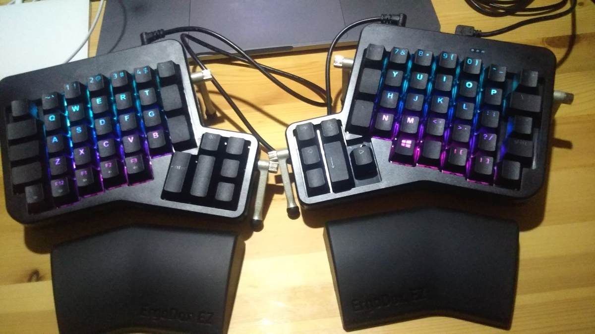

  

[ergodox-ez.com](https://ergodox-ez.com/)
  
注文画面でいろいろ、光らせるようにするかとかリストレストも付属するとか選択肢があり、注文を終えると3週間ぐらいでお家に届きました。
（時期が時期だったので注文からの発注大変そうと思いました。）  
注文内容としては以下のもので  
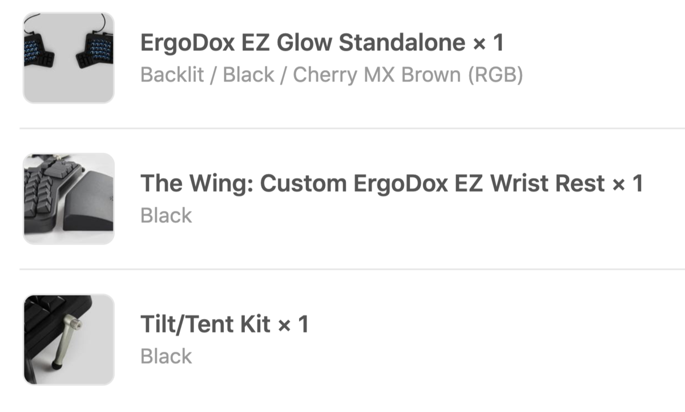

  
- ErgoDox EZ Glow Standalone × 1
  - Glowというのが光るやつ ただし親指の箇所など端の箇所は光らない
  - Backlit / Black / Cherry MX Brown (RGB)
    - BlackのほかWhiteもある
    - 茶軸以外も選択可能
- The Wing: Custom ErgoDox EZ Wrist Rest × 1
  - Black
    - 黒しかない
- Tilt/Tent Kit × 1
  - Black
    - これも黒しかない
全部込みで注文しました。  
注文したもの以外でキーキャップを外す道具もおまけでついてきたのですがこれ結構使いやすかったです。  
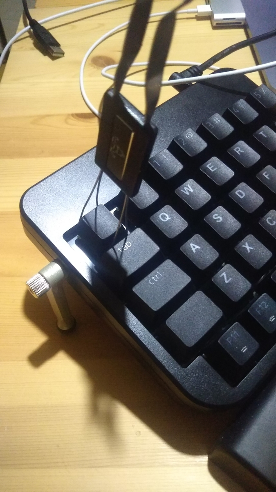

  
あと、キーのイメージ変えたいのと自作でキーキャップ 欲しかったので↓のを注文したのですが今回あまり使いませんでした。
一部数字など使用しています。  
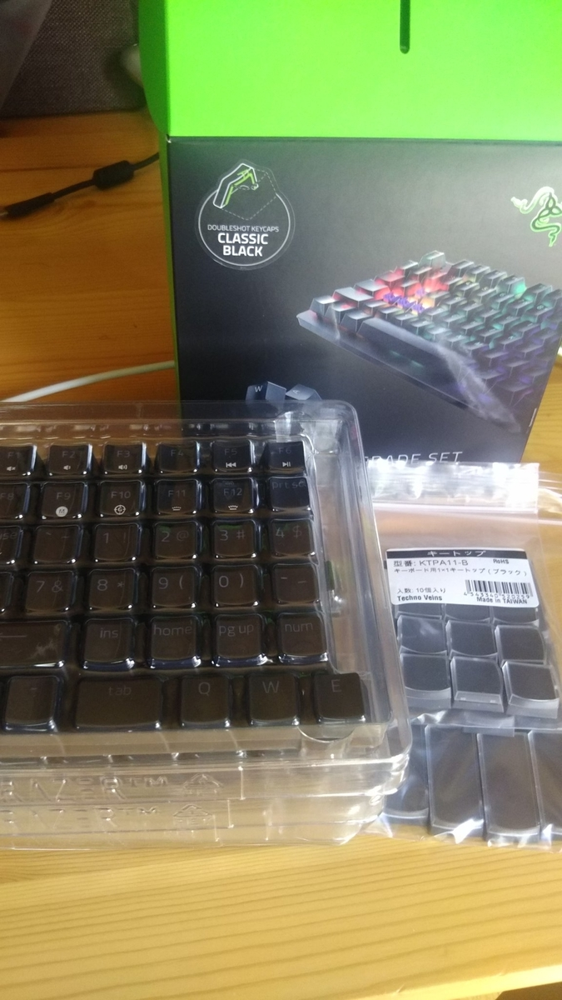

  
[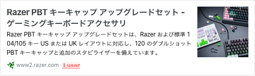](https://www2.razer.com/jp-jp/gaming-accessories/razer-pbt-keycap-upgrade-set)
[www2.razer.com](https://www2.razer.com/jp-jp/gaming-accessories/razer-pbt-keycap-upgrade-set)
  
さすがゲーミングの製品を扱っているだけあって光るキーボード用のキーキャップも販売していました。  
[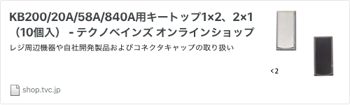](http://shop.tvc.jp/?pid=40897107)
[shop.tvc.jp](http://shop.tvc.jp/?pid=40897107)
  
[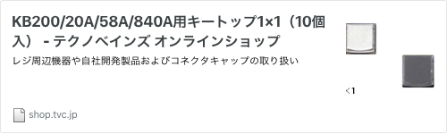](http://shop.tvc.jp/?pid=40897248)
[shop.tvc.jp](http://shop.tvc.jp/?pid=40897248)
  
こちらのキーキャップ はPOSレジ用のですが万が一、やっぱりちゃんと文字が印刷されたキーキャップ欲しいとなったとき、自由に紙に印刷したものを使用できるような保険のものです。  
今回はわりと不自由しなかったので使いませんでした。  
で、あとはキーの配置も変えたりしました。  
画像にするとこんな感じです。  
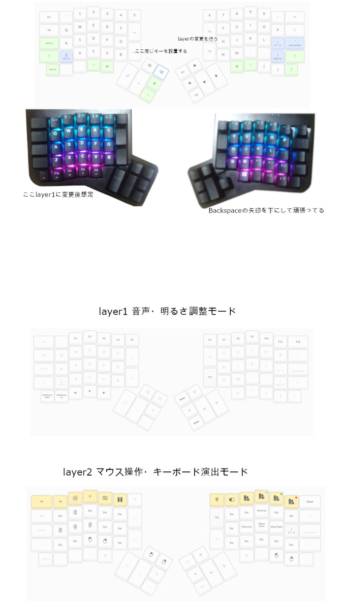

  
もしこのキーマップを使用したい場合は下記を使っていただければと思います。  
[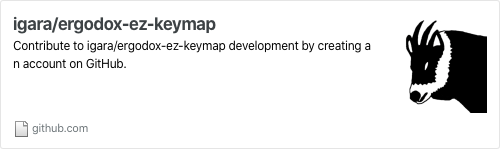](https://github.com/igara/ergodox-ez-keymap)
[github.com](https://github.com/igara/ergodox-ez-keymap)
  
[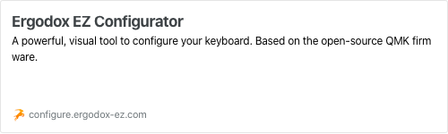](https://configure.ergodox-ez.com/ergodox-ez/search?q=igarashi&legacy=false)
[configure.ergodox-ez.com](https://configure.ergodox-ez.com/ergodox-ez/search?q=igarashi&legacy=false)
  
このキーボードを使用してまだ1週間かかってないぐらいですが使ってみての感想として  
格子配列っていうんですかね?
今まで使用していたキーボードと比べてキーの位置が水平垂直にあるのでちょっとまだ慣れてないところがあってまだ満足に使用できていないなぁという感じです。
よく使うキーボードってQWERTY配列というらしいのですが初めてキーボードの歴史を調べるきっかけを作ってくれた気がします。  
あとは親指で選択するキーが多いのでどれを設置しようかという迷いがありました。
よく使いそうなのを親指にやろうとしても今まで使っていた箇所にやたら指を動かしてしまうみたいなのが癖で多かったりするのでしばらくは慣れるように頑張るしかないなぁって思います。
特にEnterとDelete  
マウス操作もできるようにしましたが今まで使用していたトラックパッドの方が操作しやすいです。
ただキーボードから手を離さないでマウスとしての操作ができるので細かい操作を要求されなければキーボードからの操作でもいいかなと思いました。  
しばらくこのキーボードを使い倒して安心して外出できるようになったらキーボード屋に行きたいと思うのでキーボード作りたい人いたらDMください。  
[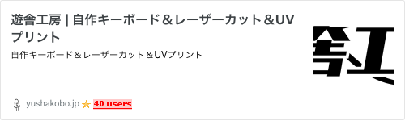](https://yushakobo.jp/)
[yushakobo.jp](https://yushakobo.jp/)
  
