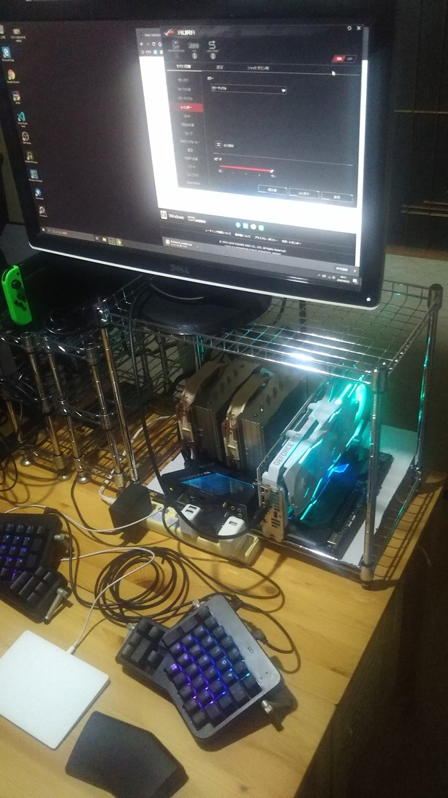
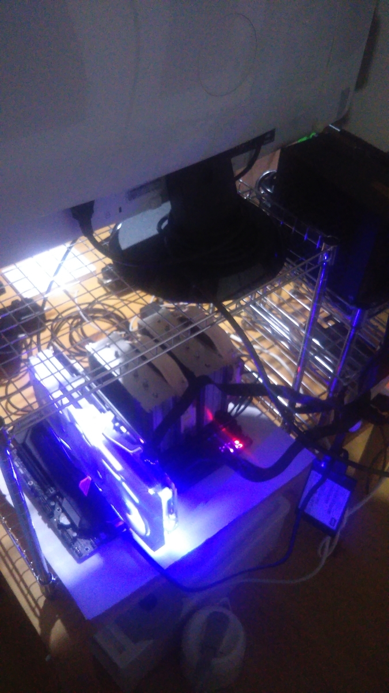
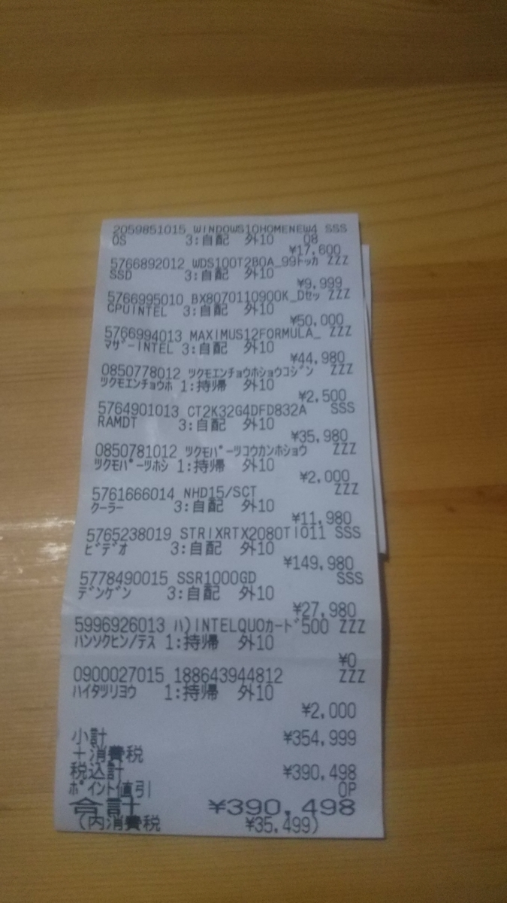
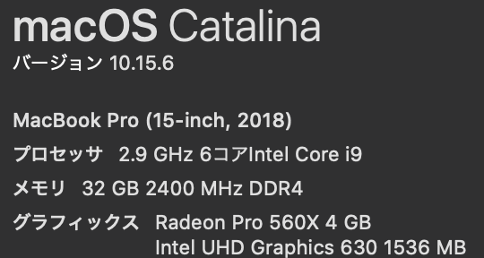
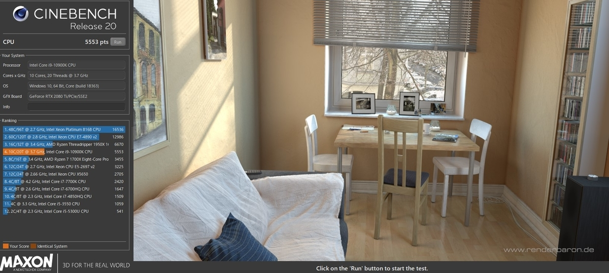
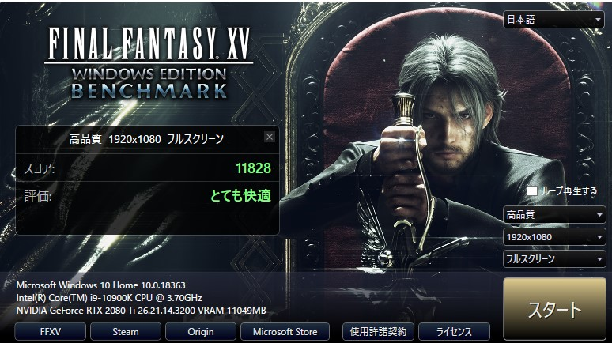
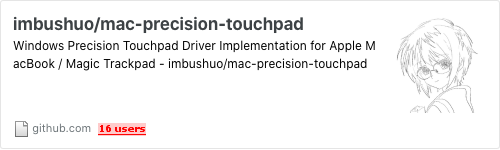

6月に古いPCを廃棄して最近のWindows 10を一度もさわったことがないというのもあったので久しぶりにパーツ見て作ってみたという話です。  
正面がこんな感じ  
  

正面

  
裏側  
  

裏側

  
購入したものの一覧として  
- OS
Microsoft Windows 10 Home
最近のWindows OSのインストールはUSBブートでできるのでDVDドライブとか付けなくても良くなったのいいすね
- CPU
Intel BX8070110900K Core i9-10900K
今使ってるMacBookも世代とコア数違うけどi9だったのでi9同士で比較したかった
- CPUファン
Noctua NH-D15
でかい
水冷はリスクありそうと思って空冷にした
- マザーボード
ASUS ROG MAXIMUS XII FORMULA
ツクモでCPUセット価格で購入した
なんかひかる
水冷にも対応しているらしく所々管を通せる仕組みがある
あとでドライバーインストールしたらWifiとBluetoothも使えるようになった
- グラフィックボード
ASUS ROG-STRIX-RTX2080TI-O11G-WHITE-GAMING
こいつもなんかひかる
あとでAura Syncというの入れて設定したらマザーボードのひかるのと一緒に止めることができた
本当は3080欲しかったけど店にあるものでいいものを探した結果これだった
- メモリ
Crucial CT2K32G4DFD832A
32GBのメモリ2枚で64GBにした
- SSD
Western Digital WDS100T2B0A
1TBのSSD
軽量なので裏側の写真通り宙にSSDが浮いている状態で置いてる
- 電源
Seasonic SSR-1000GD
1000Wの電源
余裕を持たせるために大きめのを購入
- ケース
ダイソー メタルラック
あえて壁がないことにより熱をこもらせないようにしている
上記のパーツを組ませたらどのくらいの大きさになるのか想定できなかったのであとで購入
金額として  
  

金額

  
これぐらいだったので  

タイトル「藤井棋士のCPUより安いPC」と呼ぶようにしています  
ベンチマークとかも今回回してみたので記載すると  

先に普段使いの2018 MacBookPro  
  

2018MacBookPro

  
な構成でCinebench回してみたら  
  

macbook cinebench

  
高いのか低いのか分かりませんが  

作成したPCをCinebenchしてみたら  
  

自作PCのベンチマーク

  
ptsという数値が倍ちかく異なっていたのでそこそこ性能良さそうです  
あとFF15のベンチマークを新しいPCの方だけやってみたら  
  

FF15ベンチマーク

  
快適そうなのでこれから3Dのゲームを高品質で楽しむことができそうです  
あとは環境構築してたりしましたが  

マウスをMagic Trackpad使いたいというのを  

[github.com](https://github.com/imbushuo/mac-precision-touchpad)
  
使えばジェスチャーで仮想デスクトップの切り替えやブラウザの拡大表示が同様に使えてよかったです  
未解決なものとしてErgodoxのキーボードがMacの設定しかないのでWindowsで使用した際に配列の違和感があるのでどう解決していこうかなって感じです  
