この記事は [Lancers（ランサーズ） Advent Calendar 2020](https://qiita.com/advent-calendar/2020/lancers)の5日目の記事になります。  
[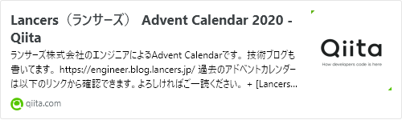](https://qiita.com/advent-calendar/2020/lancers)
[qiita.com](https://qiita.com/advent-calendar/2020/lancers)
  
- [まえがき](#まえがき)
- [前提知識: 使用しているキーボードの配列](#前提知識-使用しているキーボードの配列)
- [ほんだい](#ほんだい)  - [先に注意](#先に注意)
  - [日本語入力切り替えの共通化](#日本語入力切り替えの共通化)
  - [ショートカットキーの共通化](#ショートカットキーの共通化)
  - [クリップボードの共通化](#クリップボードの共通化)

    
- [さいごに](#さいごに)
### まえがき

システム開発している 五十嵐です。  
この記事は、2020年弊社アドベントカレンダー キーボードについて書く枠 代表として書きたかったので書きました。  

数少ないErgodox派としてのアウトプットをしたいというのもあります。  

半年前、こんな記事書いててなんやかんやでこのキーボードに慣れました。  
[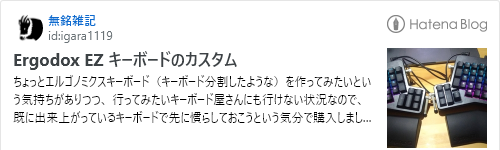](https://igara1119.hatenablog.com/entry/2020/05/10/002501)
[igara1119.hatenablog.com](https://igara1119.hatenablog.com/entry/2020/05/10/002501)
  
とはいえ、業務に関係ないですけど最近は個人のWindows機ともキーボード併用してて、  

macOSとWindowsのOSの違いによる同じ操作感で使用できない問題点が出てきてたので  

どのようにして問題解決したのかを重点的に記載できればと思います。  
記事のタイトルにErgodox入れなかったのは、USキーボードだったら共通の話題になるのかなぁと思い、外しています。  
### 前提知識: 使用しているキーボードの配列

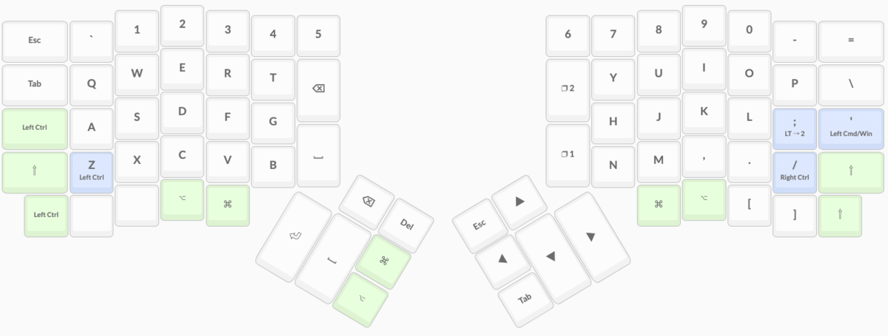

  
上記はMacbookのUSキーボードの配列に近い形に設置しています。  
例えば  
- 左上Esc
- 左上Tab
- 左下・右下Shift
- 下側にCommand, Option
ちょっと例外的な配列で  
- 左親指位置にEnter, Space, Backspace, Delete
- 左下Control
（MacBookでCaps LookをControlに置き換える作業ってみんなやらない？）
- 右親指位置にEsc, Tab, Up, Down, Left, Right
※この配列は若干ターミナル操作を意識したものにしてますが実際はEsc, Tab左上のを使うことが多いです。
実際の写真で見るとわかるのですがDownが大きめの記号のShiftキーを下方向に反転させてます。
カーソル操作でめっちゃガチャガチャするときなどに、このデコボコしてる感がいい感じに手に馴染みます。
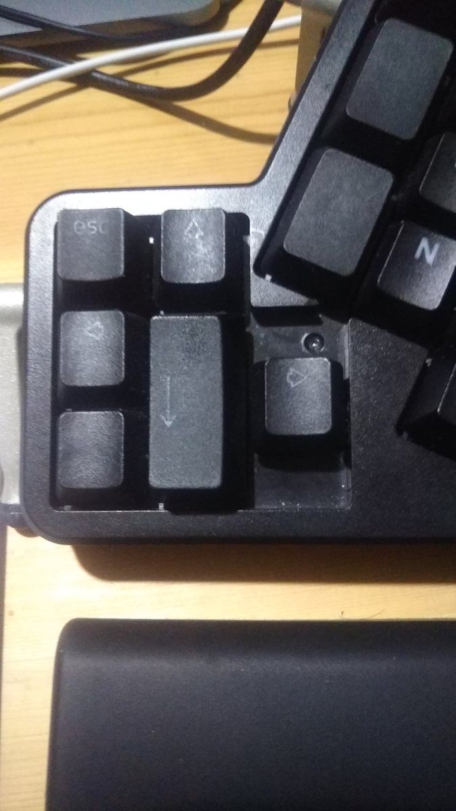

  
そもそもなんでUSキーボードを使うようになったかというと  

たまにデフォルトの入力作業がUS配列というものがあるからUSキーボードに慣れてた方が良いと思ったのがあります。  

（最近はあまりないですがRaspberry PiとかLinuxサーバ上のターミナル作業とか）  
### ほんだい

#### 先に注意

Windowsのキーボード操作改善のためにAutoHotKeyを使用した方法を記載しています。  

**一部、チート対策や自動化作業によるマクロ対策がされているソフトウェアを起動できなくなる可能性がありますのでその際はこのマクロを停止してから実行するようにお願いします。**  

（実際、某オンラインゲームを起動しようとしたらAutoHotKeyが原因で起動できなかった）  
#### 日本語入力切り替えの共通化

macOSでは ⌘英かな というアプリケーション使って左右のCommandキーで英字 / 日本語入力の切り替えを行っています。  
[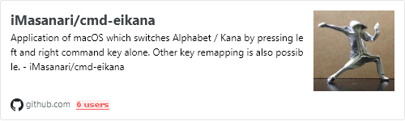](https://github.com/iMasanari/cmd-eikana)
[github.com](https://github.com/iMasanari/cmd-eikana)
  
前はKarabiner-Elementsで切り替えしてましたがOSアップデートのタイミングで使えなくなることが多かったので最近はこちらのアプリを使うことが多いです。  
Windowsでは CommandキーがWindowsキー扱いされるのでAutoHotKeyというソフトウェアを使ってWIndowsキー押したら日本語入力するようなマクロを起動するようにしました。  

[github.com](https://github.com/igara/ergodox-jp-autohotkey)
  
マクロの内容として該当する箇所がこちらになります。  
[https://github.com/igara/ergodox-jp-autohotkey/blob/3a8805d2254922ea648e10b2b45f937e3e35a952/ergodox-jp-autohotkey.ahk#L1-L15](https://github.com/igara/ergodox-jp-autohotkey/blob/3a8805d2254922ea648e10b2b45f937e3e35a952/ergodox-jp-autohotkey.ahk#L1-L15)  
#### ショートカットキーの共通化

OSの違いによるキーボードの操作の違いとしてショートカットキー（ホットキー）の違いや  

macOSではCommandキーをよく使うけど  

WindowsではControlキーをよく使うなどソフトウェアでの違いがあったりすると思います。  
macOS側は特別な設定をしていないです。  
Windows側ではまたAutoHotKeyによるマクロで  

複数のキーを同時に押す場合はWindowsキーをControlキーに置き換えするようにしています。  
[https://github.com/igara/ergodox-jp-autohotkey/blob/3a8805d2254922ea648e10b2b45f937e3e35a952/ergodox-jp-autohotkey.ahk#L17-L75](https://github.com/igara/ergodox-jp-autohotkey/blob/3a8805d2254922ea648e10b2b45f937e3e35a952/ergodox-jp-autohotkey.ahk#L17-L75)  
全てのアルファベットキーを置き換えしなかったのもWindowsキー + Rなどの便利なショートカットもあるので対応していなく、比較的よく使うものだけを対応しています。  
対応できていないものとして  

キーを3つ使うようなの（Control + Shift + Fなど） ができていないので残課題です。  
#### クリップボードの共通化

macOSでは Clipy 使ってます  
[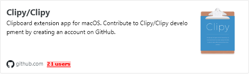](https://github.com/Clipy/Clipy)
[github.com](https://github.com/Clipy/Clipy)
  
キーボードの配列の話でもありましたがCaps LookをControlとしておいている都合上、左手小指で一番下らへんを2回タップするとクリップボードを開く設定にしてます。    

この操作のスカカって感じ結構好きです。  

Enterをターンするようなものだと思ってください。  

この点に関してはMacBookのキーボード US / 日本語配列関係なく共通です。  
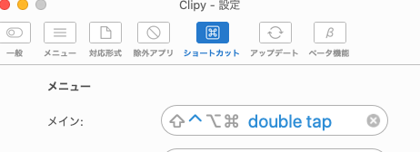

  
WindowsではWindows 10からWindowsキー + V 押すことでクリップボード開けるようになりましたが  

ショートカットキーの共通化により貼り付けのショートカットキーに上書きされて、  

代わりに Clibor によるクリップボードを使うようにしています。  
[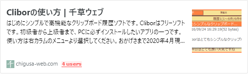](https://chigusa-web.com/clibor/)
[chigusa-web.com](https://chigusa-web.com/clibor/)
  
こちらもmacOSと同様にControlを2回押すことでクリップボードを表示する設定にすれば同じように使用することが可能になります。  
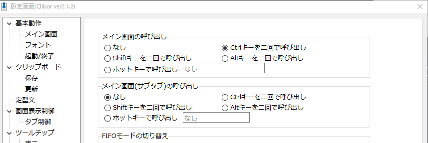

  
辞書のような定型文登録ができて純粋に優れているから Clibor 使っているというのもあります。  
### さいごに

だいぶこの対応で環境の違いによる違和感を消化することができました。  

誰かが同じような問題を抱えてて、この記事を元により効率を上げることに繋がればといいなぁと思います。  
以上でこの記事は終わりになります。  
過去にも弊社のアドベントカレンダーでキーボードの話題がありますので  

宣伝になっちゃうんですけどこちらも見ていただけますと書いた人が喜ぶんじゃないかなぁと思います。  
[ランサーズ Advent Calendar 2016 - Qiita](https://qiita.com/advent-calendar/2016/lancers)  
[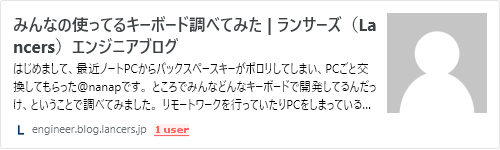](https://engineer.blog.lancers.jp/2016/12/%E3%81%BF%E3%82%93%E3%81%AA%E3%81%AE%E4%BD%BF%E3%81%A3%E3%81%A6%E3%82%8B%E3%82%AD%E3%83%BC%E3%83%9C%E3%83%BC%E3%83%89%E8%AA%BF%E3%81%B9%E3%81%A6%E3%81%BF%E3%81%9F/)
[engineer.blog.lancers.jp](https://engineer.blog.lancers.jp/2016/12/%E3%81%BF%E3%82%93%E3%81%AA%E3%81%AE%E4%BD%BF%E3%81%A3%E3%81%A6%E3%82%8B%E3%82%AD%E3%83%BC%E3%83%9C%E3%83%BC%E3%83%89%E8%AA%BF%E3%81%B9%E3%81%A6%E3%81%BF%E3%81%9F/)
  
[Lancers（ランサーズ） Advent Calendar 2018 - Qiita](https://qiita.com/advent-calendar/2018/lancers)  
[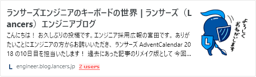](https://engineer.blog.lancers.jp/2018/12/lancerskeyboard/)
[engineer.blog.lancers.jp](https://engineer.blog.lancers.jp/2018/12/lancerskeyboard/)
  
次回 6日目 まみーさん による 「MySQLの話を何か」です。  

引き続きよろしくお願いします。  
