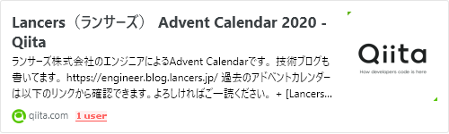
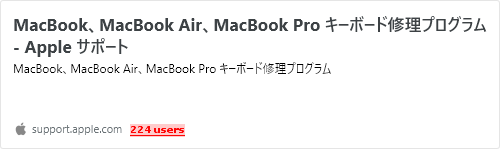
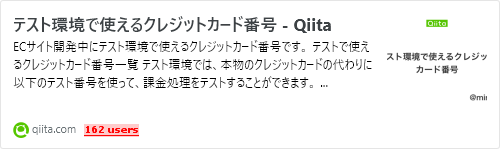
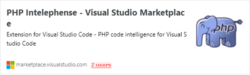
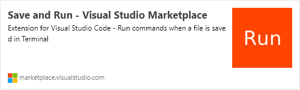
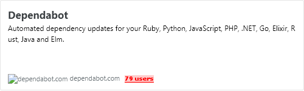

この記事は [Lancers（ランサーズ） Advent Calendar 2020](https://qiita.com/advent-calendar/2020/lancers)の9日目の記事になります。  
[](https://qiita.com/advent-calendar/2020/lancers)
[qiita.com](https://qiita.com/advent-calendar/2020/lancers)
  
- [まえがき](#まえがき)
- [ピックアップしたもの](#ピックアップしたもの)  - [チャタる](#チャタる)
  - [Slackのアイコンを自分の顔にした](#Slackのアイコンを自分の顔にした)
  - [スプレッドシートをスプシ言うかスプレと言うか](#スプレッドシートをスプシ言うかスプレと言うか)
  - [Wayする【動詞】](#Wayする動詞)
  - [テスト環境で使えるクレジットカード番号](#テスト環境で使えるクレジットカード番号)
  - [VSCode系](#VSCode系)    - [CakePHPのテンプレートとjQueryとインテリセンス](#CakePHPのテンプレートとjQueryとインテリセンス)
    - [Save and Run で自動でテストと整形するようにする](#Save-and-Run-で自動でテストと整形するようにする)

            
  - [みんなのClipyを晒す会](#みんなのClipyを晒す会)    - [GitHubのコメントをスニペット化](#GitHubのコメントをスニペット化)
    - [業務効率系のスクリプトをスニペット化](#業務効率系のスクリプトをスニペット化)

            
  - [SlackBot開発](#SlackBot開発)    - [Botがチャンネルをハシゴしてコメント投稿する機能](#Botがチャンネルをハシゴしてコメント投稿する機能)

            
  - [CakePHPのユニットテストのFixtureの定義議論](#CakePHPのユニットテストのFixtureの定義議論)
  - [リグレッションツール導入したい](#リグレッションツール導入したい)
  - [リモート手当てのようなもの取り入れたい](#リモート手当てのようなもの取り入れたい)
  - [ライブラリのセキュリティ的なアップデート検知できるものを導入したい](#ライブラリのセキュリティ的なアップデート検知できるものを導入したい)

    
- [さいごに](#さいごに)
### まえがき

入社して3ヶ月になりました。五十嵐です。  
この記事は、Slackにある自身の分報チャンネルを振り返ってみてどんなことあったのかとかやりたいこと、共通の話題にできそうなものをピックアップしてみる記事です。  
世間的にフルリモート推奨される事態になり、雑談をすることが減ったこともあって、今年は雑談として分報を活用することが多かったなと思います。  

業務のわからないとこなどを雑にプッシュすることもありますが、雑談と業務の話の割合は1対1ぐらいなんじゃないかなと思います。
あと分報以外では、時間をあわして対応したいときなどには Slack Call などのテレビ電話で会話ベースで作業を進めることもあります。  
下記にピックアップしたものを記載しますが、多くなると思いますのでメモ書きベースな感じで書いていきたいと思います。  
**どんな気持ちでこの記事を見れば良いのかというとリモート作業でも弊社はこんな雰囲気なんだという感じにみていただければ良いかなと思います。**  
### ピックアップしたもの

#### チャタる

MacBook支給されてキーボードの操作で不具合がなさそうだったので  

「今回のMacBook Pro今のところチャタらないので多分あたり枠(13-inch, 2019」  

と言ったときにチャタるとは？となった話です。  

正しくはチャタリングのことで、MacBookのキーボード不具合について公式で修理を受け付けてますというページが去年ぐらいに出てたというのもあってなんとなく分報に流しました。  
[](https://support.apple.com/ja-jp/keyboard-service-program-for-mac-notebooks)
[support.apple.com](https://support.apple.com/ja-jp/keyboard-service-program-for-mac-notebooks)
  
#### Slackのアイコンを自分の顔にした

顔をあわすことが少ないと思うので入社手続きで出社したときに撮った写真を顔だけ切り抜きしてアイコン化しました。  
後にSlackの絵文字化もして、メンションされて個人のアピールしたいときにリアクションするために使うようになります。  


  
この際に作成した動く画像をGoogleアカウントのプロフィール画像にも登録したらカレンダーやスプレッドシート上でも動く顔が表示されるようになりました。  
#### スプレッドシートをスプシ言うかスプレと言うか

弊社ではスプシ派が多そうです。  

僕はスプレ派でこれからもスプレと言い通すのでしょう。  
#### Wayする【動詞】

入社したときの資料の名前を見てやたら〜Wayと書いてあったので  

「Wayする【動詞】 という語録が存在しそう」  

と、ふと分報に記載したものです。  
弊社限定かもしれませんがツールの使い方や社内規定のようなものをWayをつけてドキュメント化するようになっているようです。  

例えばSlackの使い方が記載されているSlack Wayとかあります。  

Wayと言うワードで共通認識化しようとする考え方は良いと思いました。  
仕組みとしてないものやよしなに力（りょく）で対応しちゃっているタスクもまだあったりするのでWay化していくことが大事だなぁと思ってます。  
#### テスト環境で使えるクレジットカード番号

支払いどうしたらいいのか聞いた時に教えていただいた記事です。  

今でも結構見ます。  
[](https://qiita.com/mimoe/items/8f5d9ce46b72b7fecff5)
[qiita.com](https://qiita.com/mimoe/items/8f5d9ce46b72b7fecff5)
  
#### VSCode系

##### CakePHPのテンプレートとjQueryとインテリセンス

PHP Intelephense (bmewburn.vscode-intelephense-client) 入れたらCakePHPのテンプレートでもjQueryの補完利くようになってこの拡張すごくない？と言う話をしました。  
[](https://marketplace.visualstudio.com/items?itemName=bmewburn.vscode-intelephense-client)
[marketplace.visualstudio.com](https://marketplace.visualstudio.com/items?itemName=bmewburn.vscode-intelephense-client)
  
##### Save and Run で自動でテストと整形するようにする

今だとXdebugと併用してDockerコンテナ内のユニットテストをデバッグしながら実行可能な状態になっているので、サンプル用のPHPプロジェクトを作成して記事化したいなぁと思っています。すごい便利です。  
[](https://marketplace.visualstudio.com/items?itemName=wk-j.save-and-run)
[marketplace.visualstudio.com](https://marketplace.visualstudio.com/items?itemName=wk-j.save-and-run)
  
#### みんなのClipyを晒す会

##### GitHubのコメントをスニペット化

approveする時や本番確認した時にPR対してのコメントをする機会があります。  

定型文をクリップボードやどこからか引用して貼り付けるような仕組みを各々持ってたりしますよねと言うあるある話がありました。  
##### 業務効率系のスクリプトをスニペット化

晒していただいた方の例で  
- 実行するビルドコマンド
コンテナ内にアプリケーション毎の異なるフロントエンドのソースがあるのでパス情報を含めたワンラインで実行できるようなビルドコマンドなど
- システムフロー上で必要なデータを作成するためのSQL
複数のテーブルに対してデータを作るようなもの
画面操作で10分くらい時間かけていたものを10秒で終わらせるようになったとか
各々の努力を感じました。  
#### SlackBot開発

業務外で対応していました。  
##### Botがチャンネルをハシゴしてコメント投稿する機能


```
@igarashi-bot say channel=#hoge_channel comment=リモート開始します。36.5
```

とコメントすれば対象のチャンネルにも投稿される仕組みを自分の分報チャンネルに入れてみました。  
Slack経由でジョブカンに打刻する仕組みがあるのですがそれプラス、勤怠連絡する用のチャンネルがあるのでどっちも忘れないようにするために  

```
/jobcan_touch @igarashi-bot say channel=#hoge_channel comment=リモート開始します。36.5
```

とコメントすれば同時に対応するようにしました。  

このコメントはClipyに保存しています。  
GASで作成しているのでどのぐらい利用枠でいけるのか謎なのでまだ個人のみでしか使用していないですが、安定してそうならこれも記事にしたいです。  
#### CakePHPのユニットテストのFixtureの定義議論

Fixture側のfield定義とModelの定義がずれていたものがあり、Fixtureに手を入れなくても済むようにできないかと話し、Fixture側も更新しようという結論になりました。  

（Fixtureの定義自体がテスト用に使用したいものの定義として別出ししているものなので）  

将来的にはCakePHPにあるbakeでうまいことできないか検討しようという会話ができました。  
本番反映するためのDDLなど別ファイルで保存してたりするのでユニットテスト環境でも併用できるようなスキーマ反映するものがあったら良さそうとも思いました。  

（該当するのがridgepoleなんだよなぁと思いつつ...）  
いろいろベストに近いものをこれからも考えていきたいと思います。  
#### リグレッションツール導入したい

様々なフロントエンドのソースがあったりするのでちょっとしたCSSの変更があったときにも差分表示できるものを導入しようか検討しています。ツールとして BackstopJS のようなものを使用して画面検証しようかと考えております。  
[](https://github.com/garris/BackstopJS)
[github.com](https://github.com/garris/BackstopJS)
  
ツールのサンプルをGitHubに管理していますがどう運用まわすかが課題になっていて  
- 誰がテスト対象の画面を追加していくか
- ページ上のイベントを実行した検証を追加するか
- CI上でWebサーバとHeadless Chrome起動できるような構成がないと検証できない
- CI運用した際に差分表示したファイルをどう設置して見えるようにするか
などなど  
#### リモート手当てのようなもの取り入れたい

家で作業することが多くなったことにより光熱費がかかるようになった反面、飲食代かからなくなったという今までになかった生活面の話があったりしました。  
月一にビデオ通話による全体会があるのですがそのときにも、リモート作業に対しての手当てを出そうという話が展開されており、iPadの貸し出しなどされるようになったというのがあります。  
#### ライブラリのセキュリティ的なアップデート検知できるものを導入したい

今のところ Dependabot を検討予定で考えており、複数あるフロントエンドのプロジェクトや既存のPHPライブラリに対して更新するべきタイミングを検知できればと思います。  
まだ業務とは関係のない個人のプロジェクトで入れて検証したぐらいなので、次回の定例で入れるか会話をした上で実施しようかと思っているところです。  
[](https://dependabot.com/)
[dependabot.com](https://dependabot.com/)
  
### さいごに

分報で言ってたことをただ箇条書きにしたような記事ですみませんでした。  

改めて振り返ってみるとちょっとした雑談のものが課題点だったり、  

分報の発言から個人としてできる会社に貢献できそうなミッションを出すきっかけにもなっているので今後も引き続き分報を続けていきたいと思います。  
以上でこの記事は終わりになります。  
次回 10日目 金澤さんのランサーズのリモートワーク化の歴史です。  

引き続きよろしくお願いします。  
