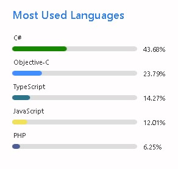

  
これは [ランサーズ Advent Calendar 2021](https://qiita.com/advent-calendar/2021/lancers) 16 日目の記事です。  
自分がどう技術と向き合っているのかというのをプライベートと現場のシチェーションを書きたいと思います。  

ここでいうプライベートは現在勤めている会社とは別で勉強したりちょっと遊びで触れるものを指し、現場は会社など仕事でのことを指します。  
さらにどういったことに心がけているのかも記載したいと思います。  
## 自己紹介

  
入社して2年目  
人生について[こちら](https://github.com/igara)に記載。  

久しぶりに人生を振り返ってみて高校生のときに将来やってみたいと思ったものを比較的実現できているなぁと思いました。  

趣味と仕事の境目がないのが悩みだったりします。  

開発するWebサービス・アプリケーションの対象が会社じゃなくて個人と開発の対象が違うだけでほぼほぼ仕事が趣味みたいなもんです。  

開発以外の趣味もありますけど、、、  
## 現場との向き合い

「秘伝のタレ」と「スパイス」をどう扱うのが良いのかというのばかり考えてます。  

既存の歴史や様々な積み重ねの仕様など「秘伝のタレ」、  

「スパイス」は新しい仕組みや機能と例えています。  
開発で「秘伝のタレ」というとカーゴカルトプログラミング、ナレッジの共有が不完全な属人化の象徴、意味もなく脳死で長年継ぎ足して運用している単一障害点など良いイメージがありませんが反面、長く運用し続けられているという事実もあるので一方的に悪口を言うつもりはありません。  
いい意味合いでのタレの更新ができるかというのはセンスが必要だよなぁと思ってます。  

例えば良いタレの更新というと  

今まで実装によって実現していたのがライブラリの更新により実装のコードがなくなったりするのは良いですね。  

（詳細はライブラリのリファレンスみてくださいと投げ出すとかは最高）  

一掃する系の更新とか無事完了すれば良いですけど影響範囲とかわかりにくいものだったりすると作業しててメンタル持ってかれますよね。  
「スパイス」は正直多くは腐らせてます。  

自分で実装しててベストじゃねぇんだよな思いつつリリースすることもあります。  

一度実装したものは後で修正することが少ないので「秘伝のタレ」ではない別のベースとなる「ソース」で作ってしまいたいと思うことがあります。  

とはいえ自分が作成したタレなので気づいたらメンテしないととも思いつつやはり「ソース」がいいんだよなというモヤッとしたりするものの、、、  
「秘伝のタレ」と「スパイス」はある意味で表裏一体なのかもしれません。  
最近だと [node-sass](https://github.com/sass/node-sass) から [dart-sass](https://github.com/sass/sass) にしたりもろもろやったけどどこか周回遅れを感じてやまない。  
各週1に社内でフロントエンド会議というのをやってますがあれは良いモチベーションの維持になってます。  

  
## プライベートとの向き合い

最近だと [(仮) NextJS モノレポ運用](https://zenn.dev/igara/articles/monorepo_nextjs) でも書いてあったとおり個人サイトのリニューアルとかやってたりします。  

あの記事の内容のを会社にもコミットできたらいいよなと優先度高めに対応してたりします。  

これが例の「ソース」なのか  

[zenn.dev](https://zenn.dev/igara/articles/monorepo_nextjs)
  
この対応の前は全然業務に関係なさそうな [Google Meetの拡張ツール](https://chrome.google.com/webstore/detail/meetchromeextention/jhcdeimoegealgbdlanjbmkigbfhbnoi)つくったり、[分報をまとめるBot](https://zenn.dev/igara/articles/bot_slack_matome_channnel)作成したりしてました。  

[chrome.google.com](https://chrome.google.com/webstore/detail/meetchromeextention/jhcdeimoegealgbdlanjbmkigbfhbnoi)
  

[zenn.dev](https://zenn.dev/igara/articles/bot_slack_matome_channnel)
  
プライベートではあまり業務に関係ないようなのを好んでやることが多いです。  

  
遊んでばかりいるから本業とは違うC#、Objective-Cのコミットが多くなってるというのは最早ネタですね。  
最近別で挑んでみたいのはVSCodeのExtension作成です。  

みんなエディター使うのにここらへんに手出すのって少なくないですか？  

自分自身がそうなんですけど  
## 心がけていること

### Webから逃げるな

開発者として既にスマホネイティブアプリ開発とかから逃げたり他分野いろいろ逃げてますが、気持ちとしてはWebというものを作る際にどう作るのかというのを考えてます。  
きたるWeb3.0たるものがあるわけで逃げたい気持ちもありますが無視せず取り合っていきましょうといった考え方です。  

前は LAMPスタック でひと通りできるというのがあった気がするんですけど、より専門にさらに分業化などがすすんでそこまでスタックを問われることが少なくなりました。  
別に専門に逃げたなとか言いたいわけではありませんが、個人的なプライドあります。  
### トップメタはなんなのか

開発というよりかはゲーム攻略からの発想です。  

会社に限定せず社会的に全環境でぶっ刺さるものがなんなのかをみようとはしているものの  

全統一なものはないので今のトップメタに近いものってなんなんだろうと常々思ってます。  
各分野のメタはいっぱいあるはずなんでこれがメタなんだという認知をしたいです。  
### 標準に寄り添うこと

トップメタが何なのかわからなくなった際に考えることです。  

ここでいう標準はサポートが多いものや IDE、静的解析に優しいものだったりします。  
ちょっと標準と異なるから専用のプラグインやVSCodeのExtensionで補えていればいいのですが、  

補えていない場合自分たちで拡張を作るというのは選択肢としてあまりない気がします。  
### マクロ的なものは積極的に得ること

バッチ、シェル、VBA、ブックマークレット、Google Apps Script、最早それアプリという気もしますが  

Chrome Extension、Electronなど自分で勝手に便利ツール化できそうなのは積極的に取り入れてたりします。  
## 終

以上、講釈でした。  
アドベントカレンダー、明日は [@shirasud](https://qiita.com/shirasud) さんです。
よろしくおねがいします。  

  
