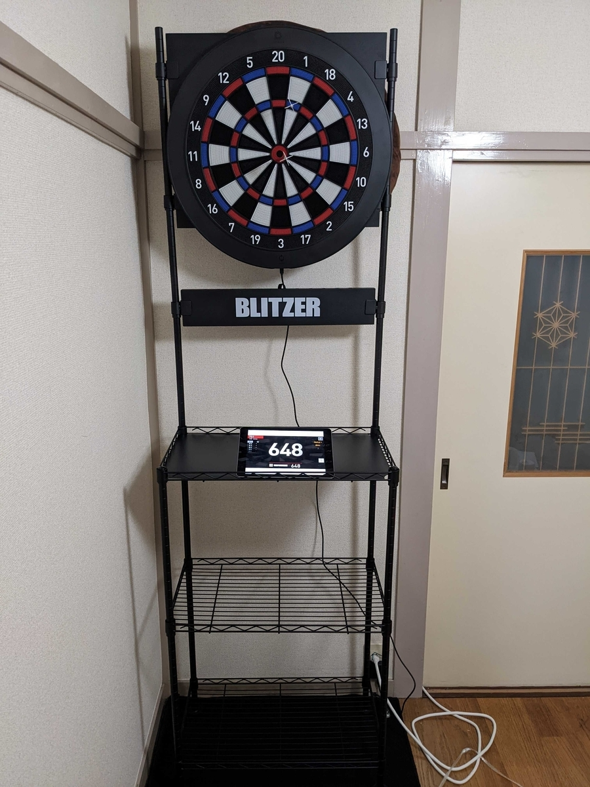
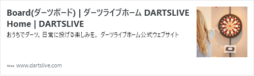
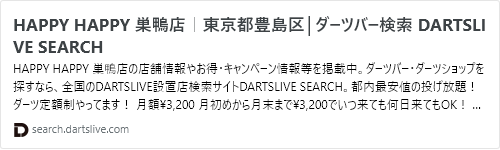
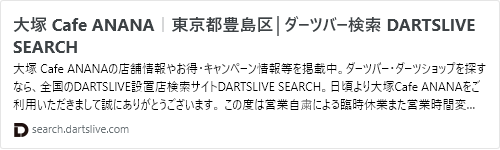
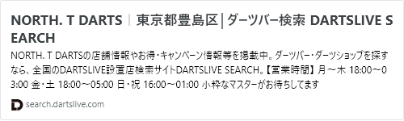
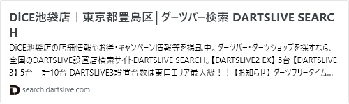
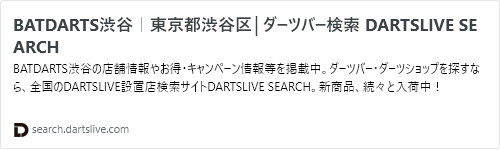
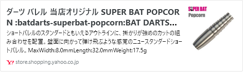
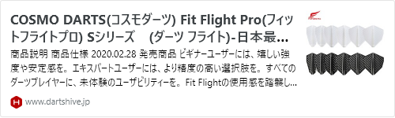

Amazonのプライムデーで安かったので家でも投げられるようになった。  

  

[www.dartslive.com](https://www.dartslive.com/jp/dartslivehome/board/)
  
DARTSLIVE Homeというの購入。
操作感がまんま店のものと近くていいっすね。
ボード自体のエフェクトもあったらいいなと思ったりも  
#### ハマったきっかけ

ソロ居酒屋やってみたいなというのがあって色々見てみた結果、継続して行けそうだったのがダーツバーだったという感じ。
ふらっとソロでカウンターで店員と話せたり、カウンターの席の客とかとダーツの対戦もお願いしやすかったりしたのでハマったのかなという気がする。  
あとはダーツバー界隈の狭さというか、他の店との繋がり（リーグとか対戦もあるので）とか交流がみれるので面白みのポイントなのかなという気もする。  
単純に一定ダーツうまくなりたいというのもあるが、
夜にダーツバーいくと寝付きが良くなった気がして自律神経がちょっと整ってるんじゃないかという感覚があったりしますね。
最近在宅勤務が多くて寝付きが悪いというの多いのかも。
少しでも散歩する意識大事かも。  
DARTSLIVEのアプリをインストールし始めなのでどこまでレーティング行けるんだろうというのは気になるとこ  
#### 行った店とか

##### HAPPY HAPPY 巣鴨店

[search.dartslive.com](https://search.dartslive.com/jp/shop/e2713ab3e1d1fec60d9b047a20a7ba1e)
  
現在のホーム。  
店員さんがプロのダーツプレイヤーだったり上達するのに今のところ一番良い環境なのかなということもあり通ってる。  
料金面では
普通の1コイン1クレジットと月額3200円で投げ放題サブスク
その他でチャージ料とワンドリンク制なので最低1000円以上の予算を考えたほうがいいかもしれない。
食べ物の注文ができないので食べ物持ち込みOKというのもありなんか北海道の大会帰りの店員の持ってきたじゃがポックルを食べてたというときもある。  
板橋の方にも支店があるのでそっちの方にも行ってみたいなと思ってる。  
##### 大塚 Cafe ANANA

[search.dartslive.com](https://search.dartslive.com/jp/shop/56116ae92b4a5a270d9b047a20a7ba1e)
  
HAPPY HAPPYとのリーグの対戦の店というのもあり気になって何回か行ってる店。  
料金面では
普通の1コイン1クレジット
スパムチャーハンなど食べ物系のメニューが普通に気になる  
##### NORTH. T DARTS

[search.dartslive.com](https://search.dartslive.com/jp/shop/e8a42605200897f00d9b047a20a7ba1e)
  
まだマイダーツを持ってないときに1回だけ行った店
マイダーツ持ってきたらかっこいい投げ方教えてやると言われ、マイダーツ買って以来一度も行ってないのでそろそろ久し振りに行きたいかなと思っている店。  
料金面では
普通の1コイン1クレジットと日額1500円で投げ放題プラン  
##### DiCE池袋店

[search.dartslive.com](https://search.dartslive.com/jp/shop/b64d4d0adf4851cf790ab824ce8730e5)
  
ネカフェ
HAPPY HAPPYのサブスク入る前とかでひたすら投げまくりたいときに通ってた。  
2~3時間でソフトドリンク飲み放題、投げ放題でコスパはなんやかんやネカフェ最強  
最近、運動不足解消のため池袋は電車使わずに徒歩で行くことが多い  
##### BATDARTS渋谷

[search.dartslive.com](https://search.dartslive.com/jp/shop/2b4a5a9a1b3b71110d9b047a20a7ba1e)
  
オリジナルのバレルのSUPER BAT POPCORNというの使ってる。
ショートなのが投げやすいのかなという雰囲気でマイダーツ購入した。  

[store.shopping.yahoo.co.jp](https://store.shopping.yahoo.co.jp/bat-store/batdarts-superbat-popcorn.html)
  
##### ダーツハイブ池袋西口店

[www.dartshive.jp](https://www.dartshive.jp/shopdetail/000000022434/#detail)
  
Fit Flight ProのS-4というのを雰囲気で買ってる  
Fit Flight AIRというのを最初使ってたが2日立たずに消耗してしまったので店員に相談して近い形でS-4いいんじゃないかというのがあって使ってる  
