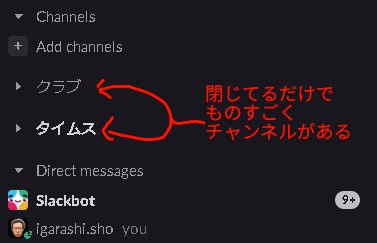

OGPサムネ用に画像を先に貼ります。  

  
作成物としては1年前のものですが無事1年運用できたので振り返りの記事になります。  

[zenn.dev](https://zenn.dev/igara/articles/bot_slack_matome_channnel)
  
また所属している会社（ランサーズ株式会社）のアドベントカレンダーの時期でしたのでこちらも目を通していただけますと幸いです。  

[qiita.com](https://qiita.com/advent-calendar/2022/lancers)
  
### 1つのチャンネルに集約するSlackボット

#### GASの利用枠から漏れずに運用できた

  

前回の記事の不穏な記載

  
前回の記事でものすごく不穏な記載があったと思い、実際に運用可能なものなのか気になっていた方いると思います。  
久しぶりにどのぐらい利用されているのかみたのですが  
  

月の関数呼び出し数

  
  
と上限の  とありますが結構まだ余裕がありそうな感じでした。  
下記は参考値程度の情報ですが参考になればと思います。  
 下記の2022年11月14日決算説明資料より  

[www.lancers.co.jp](https://www.lancers.co.jp/ir/library/)
  
  
アクティブなチャンネルかはその時々で変わるのであまり参考にならなそうですね。  
とりあえず1日で500 ～ 700 / 20000 の範囲で動かす実績解除しました。  
#### 分報以外のチャンネル集約チャンネルを作成した

GASの利用枠が結構あることがわかったので最近は他のチャンネルもまとめるようにしました。  
それがサムネにもあるbot_clubsやbot_devだったりするのですが作った意図として
チャンネルに参加していないと知り得ない情報がちょくちょくあるな思い、
とはいえそこまでチャンネルに参加するまでもないのでメッセージがみえるものだけが欲しかったので追加しました。  
社内Slackの運用的に分報は、開発用チャンネルは、部活動はとプレフィックスが決まっているので収集すべきチャンネルが自動的に適応しやすい環境だったので追加もしやすかったです。  
チャンネル集約チャンネルあると便利な点として
1つのチャンネルで網羅できるのもあるのですが、
Slackのチャンネル一覧にある機能でセクションを置くのがあると思いますが、
セクションを閉じたままでチャンネルを確認できるようになるのでスクロールさせる無駄がなくなるんですよね。  

  
### おまけ

#### bot_notionチャンネルを作成した

このチャンネル自体はGASによる集約ではなくNotion公式にあるによる通知です。  

[www.tagtec.net](https://www.tagtec.net/notion-slack-notification/)
  
Notionの記事をちゃんとツリー構造に管理していたらすべての記事に対して変更やコメントしたものもSlackに流れてきます。  
参加できないミーティングでも通知経由に音声がなくてもミーティングに参加しているかのような体験を感じたり、いち早く変更の情報に気づけるのでNotionによるコミュニケーションもありだなと思ってたりします。  
